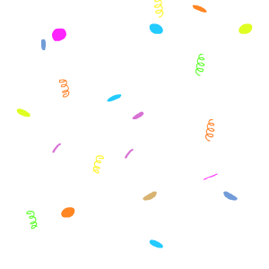
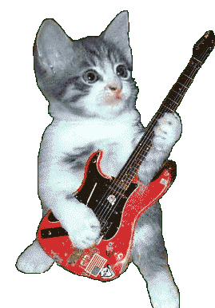

<!DOCTYPE html>
<html lang="en">

<head>
    <meta charset="UTF-8">
    <meta name="viewport" content="width=device-width, initial-scale=1.0">
    <title>Birthday card</title>
    <link rel="stylesheet" href="style.css">
</head>

<body>
    
    
    

        

            

                

                    <h3 class="happy">HAPPY</h3>
                    <h2 class="bday">BIRTHDAY</h2>
                    <h3 class="toyou">to you!</h3>
                

                

                    

                    

                

                

                    

                    

                

                

                    

                    

                

            

            

                

                    
                    
                

                

                    <h3 class="happy">HAPPY</h3>
                    <h2 class="bday">BIRTHDAY</h2>
                    <h3 class="toyou">to you!</h3>
                

                

                    
Dear Bestie,

                    
Happy birthday Riyanshi!! I hope your day is filled with lots of love and laughter! May all of your
                        birthday
                        wishes come true.

                        
~  

                    

            

        

    

    
</body>
